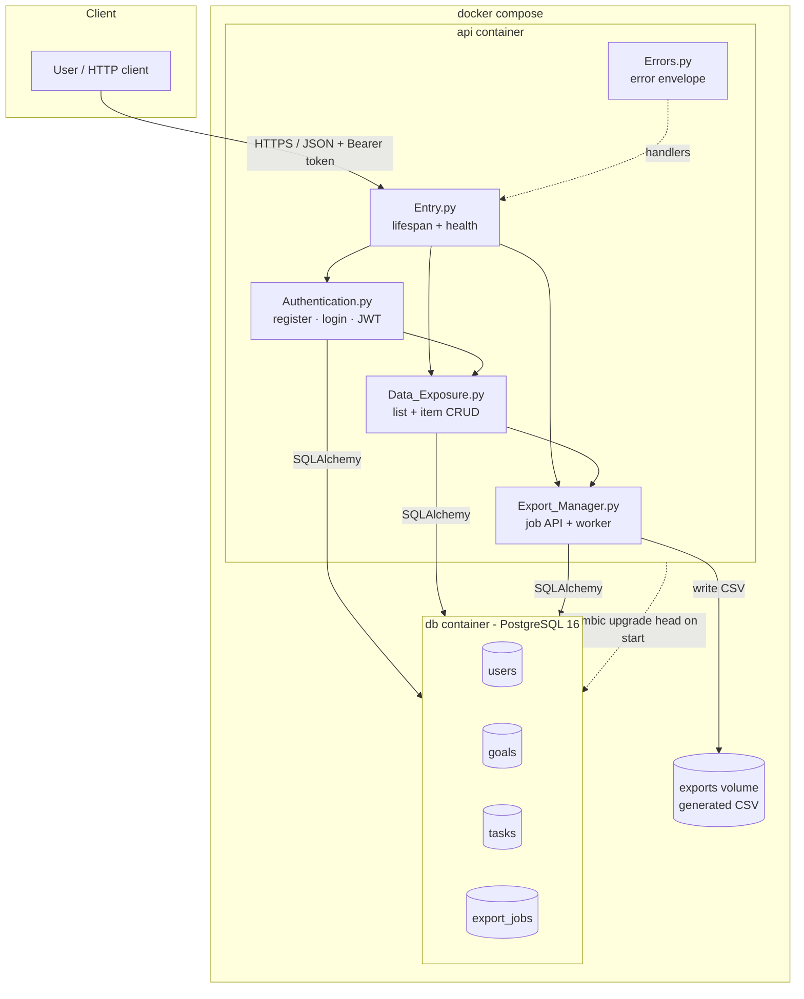
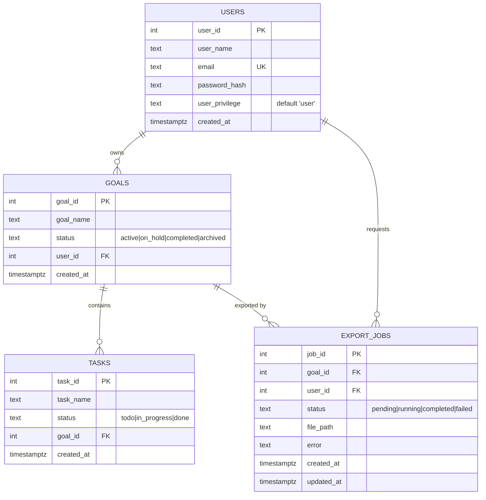

# Swibit Catalog API — Design

Personal Catalog API where each user owns **lists**, each list contains
**items**, and a list can be exported to a CSV file by a background job.

- **Stack:** Python 3.11 · FastAPI · PostgreSQL 16 · SQLAlchemy 2 · Alembic · Docker Compose
- **Auth:** stateless JWT (HS256) + bcrypt password hashing
- **Async:** in-process FastAPI `BackgroundTasks` for exports

---

## 1. Domain flavour and the List/Item mapping

The task fixes the shape as `User → List → Item` but leaves the real-world
meaning to me. I chose **a project board**: a *List* is a project board and an
*Item* is a task.

`DESIGN.md` originally fixed the database table names as `goals` and `tasks`,
and I kept them, so the mapping is:

| Task's concept | This project's name | Database table | Notes |
|---|---|---|---|
| User | User | `users` | account + login identity + owner |
| **List** | **Goal** | `goals` | `goal_name` = the list's name/title, `user_id` = owner |
| **Item** | **Task** | `tasks` | `task_name` = the item's title, `status` = its category |
| (extension) Export job | Export job | `export_jobs` | a background export of one list |

`users.goals → tasks` is exactly "List → Item". A list has a name and an
owner; an item has a title and a status and belongs to exactly one list.

**Statuses.** Both levels carry one:

| Column | Allowed values | Why |
|---|---|---|
| `goals.status` | `active`, `on_hold`, `completed`, `archived` | a board's own lifecycle |
| `tasks.status` | `todo`, `in_progress`, `done` | a task's progress |
| `export_jobs.status` | `pending`, `running`, `completed`, `failed` | the job lifecycle |

---

## 2. Architecture



As text:

```
client ──HTTP/JSON──> api container (uvicorn)
                       │  Entry.py        lifespan: wait for Postgres
                       │  Authentication  /auth/*        → JWT
                       │  Data_Exposure   /goals, /tasks → SQLAlchemy
                       │  Export_Manager  /exports/*    → BackgroundTasks
                       │  Errors.py       one error envelope
                       │
                       ├──SQLAlchemy──> db container (PostgreSQL 16)
                       │                  users, goals, tasks, export_jobs
                       └──CSV files──> exports volume
```

`docker compose up --build` starts both containers, waits for the database
healthcheck, runs `alembic upgrade head`, then starts uvicorn. One command,
no manual database steps.

---

## 3. Data model



### Indexes and why

| Index | Serves |
|---|---|
| `users_email_key` (UNIQUE) | login by email, and enforces one account per email |
| `ix_goals_user_id` | "my lists" listing, filtered by owner on every request |
| `ix_tasks_goal_id` | a list's items, and the `ON DELETE CASCADE` lookup |
| `ix_export_jobs_goal_id` | jobs for one list |
| `ix_export_jobs_user_id` | the authenticated user's export history |

All four are on the columns used to *scope* a query to one user or one list,
which is the hot path for every protected endpoint. Primary keys are covered
by PostgreSQL automatically.

### Key constraints

| Constraint | Purpose |
|---|---|
| `users.email` UNIQUE | duplicate registration is a 409, not silent corruption |
| `goals.user_id → users.user_id` ON DELETE CASCADE | deleting a user removes their lists, items and jobs |
| `tasks.goal_id → goals.goal_id` ON DELETE CASCADE | deleting a list removes its items |
| `export_jobs.goal_id` / `.user_id` ON DELETE CASCADE | jobs cannot outlive their list or owner |
| `ck_goals_status` CHECK | `goals.status ∈ {active, on_hold, completed, archived}` |
| `ck_tasks_status` CHECK | `tasks.status ∈ {todo, in_progress, done}` |
| `ck_export_jobs_status` CHECK | `export_jobs.status ∈ {pending, running, completed, failed}` |
| `NOT NULL` + `server_default` on all statuses | an invalid status is impossible even from raw SQL |

The three CHECK constraints are deliberately duplicated in the database, not
just in Pydantic. The API rejects a bad value with 422 before it reaches the
database, and the database rejects it anyway if anything bypasses the API.
`Test/Conflict.py` proves this by writing an invalid status through raw SQL and
asserting the database refuses it.

### Migrations

Schema changes are managed by **Alembic**, never `create_all`, so the
database can never drift from the migration history.

| Revision | What |
|---|---|
| `5c67dfe515f5` | initial schema: `users`, `goals`, `tasks`, `export_jobs` |
| `5d421fca8e87` | add `goals.status` + `ck_goals_status` |

`alembic/env.py` imports the real models for autogenerate and reads
`DATABASE_URL` from the same environment variable as the application, so the
migrator and the app can never connect to different databases. The container
entrypoint runs `alembic upgrade head` before uvicorn starts.

`Base.metadata.create_all()` still exists in `Database_Manager.init_db()`, but
it is only used by the test suite to build its throwaway database quickly.

---

## 4. Request data flow

Every protected request follows the same path:

```
1. bearer token present?  ── no ──> 401 unauthenticated
2. jwt.decode(secret, HS256)  ── fail ──> 401 unauthenticated (expired / bad signature)
3. load users row from `sub`  ── gone ──> 401 unauthenticated
4. route handler: Pydantic validates the body  ── fail ──> 422 invalid_input
5. load the target row by id                     ── absent ──> 404 not_found
6. check the row belongs to the caller           ── no ──> 403 forbidden
7. apply the change and COMMIT
```

Steps 5 and 6 are the important ones, and they live in exactly two helpers -
`_get_owned_goal`, `_get_owned_task` and `_get_owned_job` - so a new endpoint
cannot accidentally skip the ownership check. Step 7 is after the check, so a
rejected request never writes anything.

Startup flow: `entrypoint.sh` → `alembic upgrade head` → uvicorn → lifespan
waits for PostgreSQL to accept connections (retrying, because compose may start
the API while the database is still initialising) → app serves.

---

## 5. Authentication and authorization

**Credentials.** Email is the login identifier (`users.email` is UNIQUE) and
passwords are hashed with **bcrypt** using a per-password random salt. The
plaintext password is never stored, logged, or returned - `UserResponse` has no
password field at all, so it is impossible to leak through a response model by
accident. Passwords are capped at 72 bytes because bcrypt rejects longer input,
rather than silently truncating.

**Tokens.** `POST /auth/login` returns a stateless JWT (HS256) whose only
payload claim is `sub` (the user id) plus `iat`/`exp`. Clients send it as
`Authorization: Bearer <token>`. `get_current_user` is a FastAPI dependency, so
a protected route is protected by declaring the dependency, not by remembering
to add a check inside the handler.

**Login timing.** When the email is unknown the code still runs a bcrypt
comparison against a throwaway hash, so a missing account and a wrong password
take comparable time and the endpoint does not reveal which emails exist.

**Authorization.** Enforced in the application layer, in the ownership helpers,
not only documented. The user story "I cannot see or change another user's
lists, items, or export jobs" is covered by
`Test/Forbidden_Access.py` and `Test/Forbidden_Export_Access.py`.

---

## 6. Background export job

**Why asynchronous.** An export reads a whole list and writes a file. Doing it
inside the request would hold a worker and a database session for the whole
export, and the client would time out. The task explicitly allows an in-process
background task provided the limitations are documented.

**Flow.**

```
POST /goals/{id}/exports
  ├─ 404 if the list does not exist
  ├─ 403 if it belongs to someone else
  ├─ INSERT export_jobs (status = 'pending', file_path = null)
  ├─ queue run_export(job_id) as a BackgroundTask
  └─ 202 Accepted  { "job_id": .., "status": "pending" }   ← returned immediately

run_export(job_id)                # after the response has been sent
  ├─ status = 'running'
  ├─ read the goal and its tasks
  ├─ write EXPORT_DIR/goal_{goal_id}_job_{job_id}.csv
  ├─ status = 'completed', file_path = <path>
  └─ on ANY exception: status = 'failed', error = "<Type>: <message>"

GET /exports/{job_id}          → current status (owner only)
GET /exports/{job_id}/download → the CSV, but only when status = 'completed'
POST /exports/{job_id}/retry   → re-queue, but only from 'failed'
```

**Reliability limits (honest).** The worker runs in the API process:

- If the process dies mid-export the job stays `running` **forever** - nothing
  requeues or fails it.
- Pending jobs are lost on restart; there is no durable queue.
- The `exports` volume is single-instance; a second API replica would not see
  files written by the first.

The failure path *within a live process* is solid: any exception is caught, the
job is marked `failed` with the error text, the list and its items are never
touched, and `POST /exports/{id}/retry` re-runs it. What is missing is
crash-recovery, not error handling.

**What I would use instead, and when.** Celery or RQ with Redis as the broker,
plus a separate `worker` container, gives a durable queue, automatic retry with
backoff, and a visibility timeout that returns a stuck `running` job to the
queue. I would add it when either (a) exports get large enough that a worker
pool matters, or (b) losing a job on restart becomes unacceptable. For a
single-container assessment API it would be a whole extra service to operate
for a benefit nobody can observe, so I documented the limitation instead of
paying that cost.

**Why CSV.** It is the format a user actually wants for a board, it is
streaming-friendly, and it needs no extra library. JSON would be a one-line
change.

---

## 7. Error contract

Status codes follow convention, but the *shape* is the thing this project
guarantees, so a client needs exactly one parser. `Main/Errors.py` registers
handlers for `ApiError`, `RequestValidationError`, Starlette's
`HTTPException`, and `IntegrityError`, so even unexpected failures land in the
same envelope.

```json
{"error": {"code": "<machine readable>", "message": "<human readable>"}}
```

Validation failures add per-field `details`:

```json
{"error": {"code": "invalid_input",
           "message": "Request validation failed.",
           "details": [{"field": "body.goal_name",
                        "message": "String should have at least 1 character"}]}}
```

| Status | `code` | Raised when |
|---|---|---|
| 401 | `unauthenticated` | token missing, malformed, expired, or signed with the wrong key |
| 403 | `forbidden` | authenticated, but the resource belongs to someone else |
| 404 | `not_found` | the id does not exist, or a `completed` job's file is gone |
| 409 | `email_already_registered` | email already in use |
| 409 | `invalid_state_transition` | retried a job that is not `failed` |
| 409 | `export_not_ready` | download attempted before the job completed |
| 409 | `conflict` | any other database constraint violation |
| 422 | `invalid_input` | Pydantic/body/pagination validation failed |
| 503 | `http_error` | `/health` only, when PostgreSQL is unreachable |

Two design choices worth naming:

- **`IntegrityError` is caught at the app layer, not globally.** A generic
  handler exists as a safety net, but duplicate email is detected *before*
  inserting so the 409 message is specific instead of generic.
- **Messages never contain a value the caller should not see.** Error text
  names the field or the resource type, never another user's data.

---

## 8. The six required robustness cases

Each row is the behaviour, the code that enforces it, and the test that proves
it. Manual examples with real output are in `TESTING.md` § Part 2.

| Case | Enforced in | Test |
|---|---|---|
| **Unauthenticated access** | `get_current_user` dependency rejects a missing/invalid token before any handler runs | `Test/Unauthenticated_Access.py` (21 cases: every protected route + 4 forgery variants) |
| **Forbidden access** | `_get_owned_goal` / `_get_owned_task` compare the row's owner with the caller after a 404 check | `Test/Forbidden_Access.py` |
| **Forbidden export access** | `_get_owned_job` + the owner check in `create_export` | `Test/Forbidden_Export_Access.py` |
| **Invalid input** | Pydantic field constraints (`min_length`, `max_length`, enums) + `Query` bounds; rejected before any write | `Test/Invalid_Input.py` |
| **Resource not found** | `db.get(...)` returns `None` → `not_found("List"/"Item"/"Export job")`; a second delete also 404s | `Test/Resource_Not_Found.py` |
| **Conflict** | `users.email` UNIQUE (pre-checked *and* caught); `ck_*_status` CHECK constraints; `retry` validates the current state | `Test/Conflict.py` |

**Why 403 and not 404 for cross-user access.** Both are defensible. Returning
404 would avoid confirming that an id exists, but the requirement names this
case "Forbidden access", and an explicit 403 makes the authorization decision
visible to a reader. I chose 403 and documented the enumeration trade-off; the
switch is a one-line change in each ownership helper.

**Database-level defence.** Validation is never the only line of defence. The
`ck_goals_status` and `ck_tasks_status` CHECK constraints mean an invalid status
is impossible even from raw SQL. `Test/Conflict.py` proves this by writing
`status = 'banana'` through `db_session.execute()` and asserting PostgreSQL
raises `IntegrityError`.

---

## 9. Project structure and the reasoning behind it

```
Swibit_Catalog/
├── Main/                 application code
│   ├── Entry.py          composition root: app, lifespan, routers, health
│   ├── Authentication.py register / login / JWT / get_current_user
│   ├── Data_Exposure.py  list + item CRUD, pagination
│   ├── Export_Manager.py export job API + background worker
│   ├── Database_Manager.py engine, session, models, DB readiness
│   └── Errors.py         one error envelope + exception handlers
├── Test/                 pytest suite, one module per required behaviour
├── alembic/              migration environment + versions
├── Dockerfile            image; entrypoint runs migrations
├── docker-compose.yml    api + db + volumes
└── entrypoint.sh         alembic upgrade head, then exec the app
```

**Why split by capability, not by layer.** `Authentication.py`,
`Data_Exposure.py` and `Export_Manager.py` are each a vertical slice: the
routers, the Pydantic schemas and the authorization for one feature live
together. When I add an endpoint I touch one file. A horizontal layout
(`routers/`, `schemas/`, `services/`) spreads one feature across four files,
which is worse at this size - roughly 1,000 lines across 6 modules.

**Why `Database_Manager.py` is not a service layer.** It owns the engine, the
session factory, the models and database-readiness only. Business rules live
with their feature, so a query is never two hops away from the endpoint that
uses it.

**Why `Errors.py` is separate.** Centralising the error envelope in one module
is the only way to *guarantee* consistency. Scattering `HTTPException` calls
across six files is how error shapes drift.

**Why `Entry.py` holds no business logic.** It composes: create the app,
register error handlers, include routers, and provide the health probe. That
keeps "what does this service do" answerable by reading one short file.

**Why the test modules are named after behaviours, not functions.** The task
is organised around six robustness cases, so the suite is too. A reviewer can
map a requirement to a file name without reading any test.

**Why the suite runs against a real database, not SQLite.** The behaviour
being tested *is* PostgreSQL behaviour: `ON DELETE CASCADE`, CHECK
constraints, and a UNIQUE violation surfacing as `IntegrityError`. A mock
would assert the wrong thing.

---

## 10. Assumptions

1. **Email is the login identity.** The task says I choose the credential
   fields; a single unique email plus a display name is the least surprising
   choice. `user_name` is therefore *not* unique - otherwise two accounts
   would fail for an unrelated reason.
2. **`user_privilege` is carried but unused.** It came from the original
   `DESIGN.md` schema. I kept the column (defaulting to `user`) so the agreed
   schema is not silently dropped, but no endpoint reads it, because the task
   describes flat per-user ownership with no roles. Adding RBAC without a
   requirement would be speculative.
3. **"List" and "Item" are `goals` and `tasks`.** The mapping is stated in
   §1 and repeated in `README.md` and the docstrings.
4. **One account owns many lists; a list owns many items.** There is no
   sharing, collaboration, or membership, because the task says a user cannot
   see another user's lists.
5. **The export is CSV** and files live on the `EXPORT_DIR` volume. Chosen
   because it needs no extra service; see §11.
6. **Items belong to exactly one list** - no cross-list tagging, since the
   task fixes a strict tree.
7. **Deletion is physical, not soft.** The task asks for delete, and
   `ON DELETE CASCADE` gives a correct, simple tree delete. A soft delete would
   need a `deleted_at` on every table plus filtering everywhere.

---

## 11. Trade-offs

Each row is the decision, the alternative I rejected, and why.

| Decision | Alternative | Why |
|---|---|---|
| **403 for cross-user access** | 404, to avoid leaking that an id exists | 404 is more private, but the requirement names this case "Forbidden access" and an explicit 403 makes the authorization decision visible. One-line change in each helper if you disagree. |
| **In-process `BackgroundTasks` worker** | Celery / RQ + Redis broker | Gives durability, retries, and crash recovery, but adds a third service to operate for a benefit you cannot observe in a single-container API. The task allows in-process if documented - §6. |
| **CSV on a Docker volume** | Object storage (S3) | Correct for many instances; here it would add credentials, a network dependency, and a failure mode for no gain. |
| **Stateless JWT** | Server-side sessions, or short-lived access + refresh | A stateless token cannot be revoked before it expires, and there is no logout. A session store would fix that at the cost of a shared store and more moving parts. Acceptable for a 60-minute token. |
| **bcrypt** | Argon2id | Argon2id is the better primitive, but bcrypt ships with a long track record and needs no extra native build. Passwords are capped at 72 bytes because bcrypt refuses longer input. |
| **Offset pagination** | Keyset / cursor | Offset degrades on very large tables and can repeat or skip rows when a row is inserted mid-pagination. Cursor pagination is the right answer at scale; at a few thousand rows offset is simpler and more readable. |
| **Migrations in the entrypoint** | A separate release step before the app starts | Convenient and single-command, but a rolling deploy would run migrations from several replicas at once. Correct long term, unnecessary for one container. |
| **Sync SQLAlchemy + `run_in_threadpool`** | `asyncpg` + async sessions | Async pays off when one process must hold thousands of concurrent connections. Here it would complicate every route and every test for no measurable gain; the background worker is synchronous anyway. |
| **`create_all` for the test database** | Replaying migrations in tests | Much faster and independent of migration ordering. The migrations are still exercised for real on every `docker compose up`. |
| **Strict `EmailStr` validation** | A permissive regex | Rejects `@localhost` and `@.test`, which is stricter than some teams want. Catches real typos; the cost is documented in `README.md` § Known limitations. |
| **No rate limiting** | Redis/slowapi limiter | Not required, and every extra service has an operating cost. Would be the first thing added if this were internet-facing. |

The two I would revisit first for production are the **background worker**
(a real broker) and **token revocation** (refresh rotation).

---

## 12. Test strategy

**82 automated tests** in 7 modules, all passing:

| Module | Tests | Covers |
|---|---:|---|
| `Test/Unauthenticated_Access.py` | 21 | 16 protected routes + malformed, wrongly-signed, and expired tokens + public routes stay open |
| `Test/Invalid_Input.py` | 27 | missing/empty/over-long/wrong-type fields, unknown statuses on create *and* update, every valid status round-trips, pagination bounds, "rejected writes nothing" |
| `Test/Resource_Not_Found.py` | 9 | every read/update/delete on a missing id, second delete 404s, cascade delete |
| `Test/Forbidden_Access.py` | 7 | Bob cannot read/rename/delete/list Alice's list, nor touch her items; collections never leak |
| `Test/Forbidden_Export_Access.py` | 5 | Bob cannot export Alice's list, inspect, retry, or download her job; history stays empty |
| `Test/Conflict.py` | 7 | duplicate email (case-insensitive), original password unaffected, invalid state transition, download-before-ready, and raw-SQL CHECK violations on both tables |
| `Test/Export_Lifecycle.py` | 6 | immediate `202`, `pending → completed`, CSV contents, failure recorded without corrupting data, retry succeeds, paginated history |

The four categories the task requires map to: authentication
(`Unauthenticated_Access.py`), cross-user isolation (`Forbidden_Access.py`),
invalid input / DB constraints (`Invalid_Input.py` + `Conflict.py`), and export
lifecycle (`Export_Lifecycle.py`).

**Isolation.** `Test/conftest.py` creates a dedicated `swibit_catalog_test`
database, builds the schema from the ORM metadata, and truncates all four
tables with `RESTART IDENTITY CASCADE` before every test. Tests therefore run
in any order, cannot touch development data, and see no leakage between cases.
`_isolate_export_worker` additionally redirects the background worker's session
factory at the test database and its output at `tmp_path`, so running the suite
never writes into the real `exports` volume.

**Why integration-style.** The risky logic here *is* the interaction between
the app and PostgreSQL - cascade deletes, CHECK constraints, and a UNIQUE
violation surfacing as `IntegrityError`. Unit tests with a mocked session
would assert that my mock behaves, not that the system does.

**Known gap.** There are no unit tests of pure functions (e.g. password
hashing round-trips, pagination arithmetic) in isolation. They are covered
indirectly through the endpoints, which is slower but tests them in context.

**Manual verification.** `TESTING.md` records manual cases with the exact
inputs and the observed responses, including a clean
`docker compose down -v` → `up --build` → migrations applied → health `200`
sequence.
